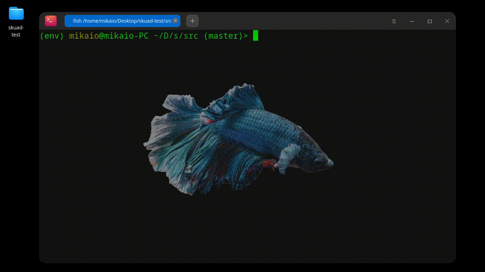

    <h1>Desafio</h1>
    </img>
    </img>
    </img>

[Link dos arquivos CSV](http://dados.cvm.gov.br/dados/FI/DOC/INF_DIARIO/DADOS/)

[Dicionário dos Dados CSV](http://dados.cvm.gov.br/dados/FI/DOC/INF_DIARIO/META/meta_inf_diario_fi.txt)

## :hammer_and_wrench: ***Exercício 1*** 

Escreva um script em python que faça o download de um arquivo CSV, e salve em um diretório local. 

O script deverá receber **dois parâmetros**: *o diretório onde o arquivo deverá ser salvo, e um mês específico no formato YYYYMM.*

##  :hammer_and_wrench: ***Exercício 2***

A partir dos arquivos obtidos no exercício anterior, faça um script que gere um relatório contendo:

- A porcentagem de variação do valor da cota.

- O valor captado entre o primeiro e último dia disponível de um mês específico.

- O valor resgatado de um fundo entre o primeiro e último dia disponível de um mês específico.

Este script deverá receber como parâmetros:
- O mês desejado no formato YYYYMM.
- O caminho do diretório onde estão os arquivos CSV.
- Receber uma lista de CNPJs. 

O script deverá calcular os valores para cada CNPJ se uma lista de CNPJs for passada por parâmetro. Caso nenhum CNPJ seja informado, o script deverá gerar um relatório de todos os fundos disponíveis.

# :pushpin: **TODO** 

> Documentar problema :heavy_check_mark:

> Configurar ambiente :heavy_check_mark:

> Script1 código inicial :heavy_check_mark:

> Script2 código inicial :heavy_check_mark:

> Refatorar e configurar testes :heavy_check_mark:

> API Bônus :warning:

> Revisar documentação :heavy_check_mark:

# :rocket: **Iniciando o projeto** 

### Clone o projeto

    # Clone o projeto do Github
    git clone https://github.com/Mika-IO/skuad-test

    # Entre na pasta do projeto
    cd skuad-test

### Crie seu container e execute os scripts

    # Crie o container
    docker build -t py-container . 

    # Entre no contexto do container
    docker run -it py-container bash
    
    # Execute o scripts 
    python script01.py <diretório> YYYYMM

    python script02.py <diretório> YYYYMM

    python script02.py <diretório> YYYYMM CNPJ0 CNPJ1 CNPJ2 CNPJ3 
    

## :label: **Testes** 

    # Na raiz do projeto digite
    pytest 

    # Para resposta verbosa
    pytest -v

    # Consulte o relatório dos testes em
    tests_relatory/tests_report.html

    # OBS: Para praticidade execute os testes numa virtualenv ou ambiente python global

    # Crie uma virtualenv
    
    pip install virtualenv
    
    virtualenv env .
    
    source env/bin/activate
    
    # Instale as dependências na sua virtualenv e seu ambiente está pronto
    
    pip install -r requirements.txt

# :checkered_flag: **Bônus** 

### Ao executar

    docker run -it py-container

### Uma API com funcionalidades semelhantes aos scripts do desafio é servida em

    # API
    http://127.0.0.1:8000

    # DOCUMENTAÇÃO DA API
    http://127.0.0.1:8000/docs
